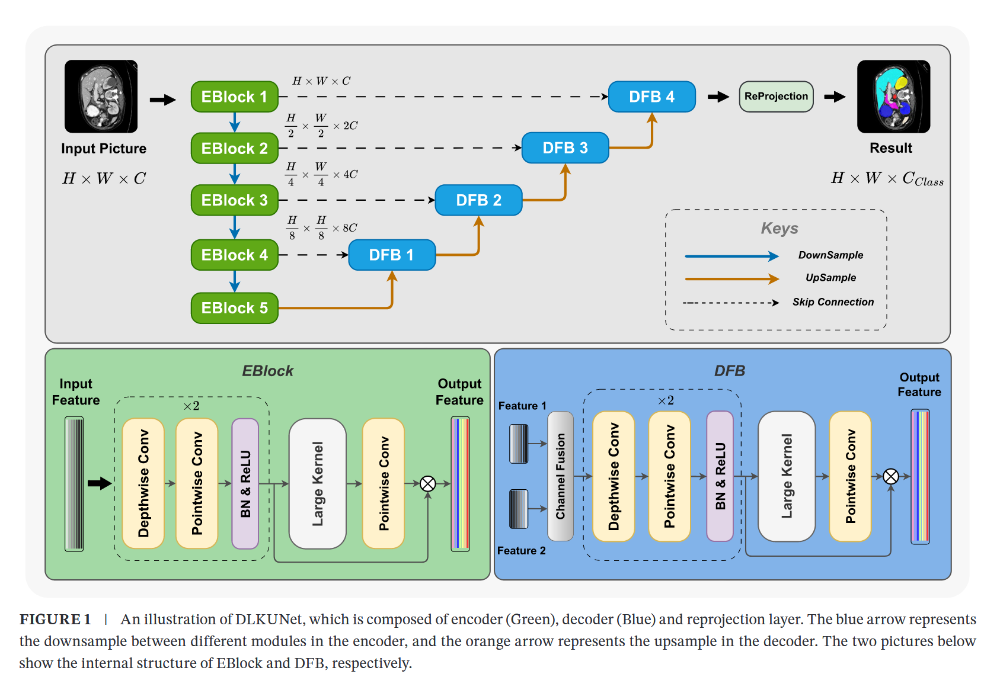
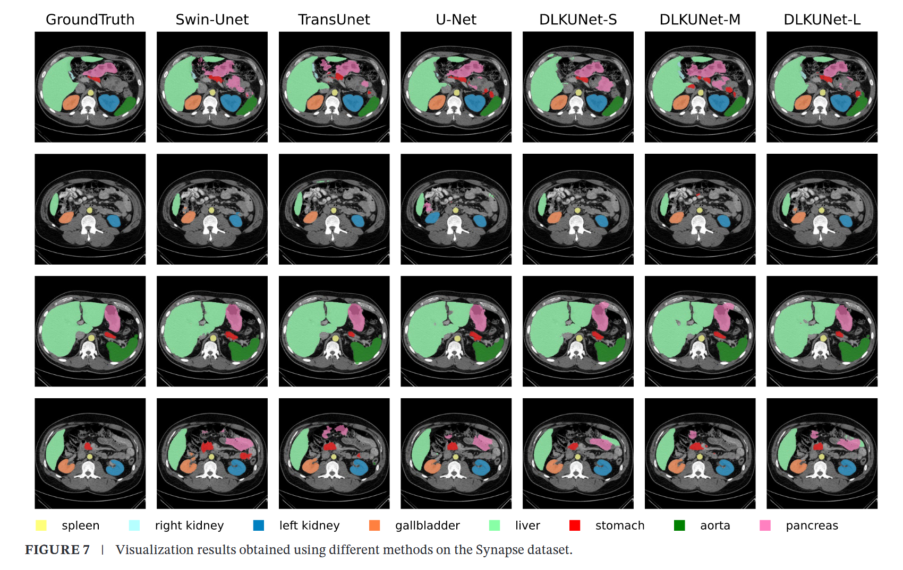
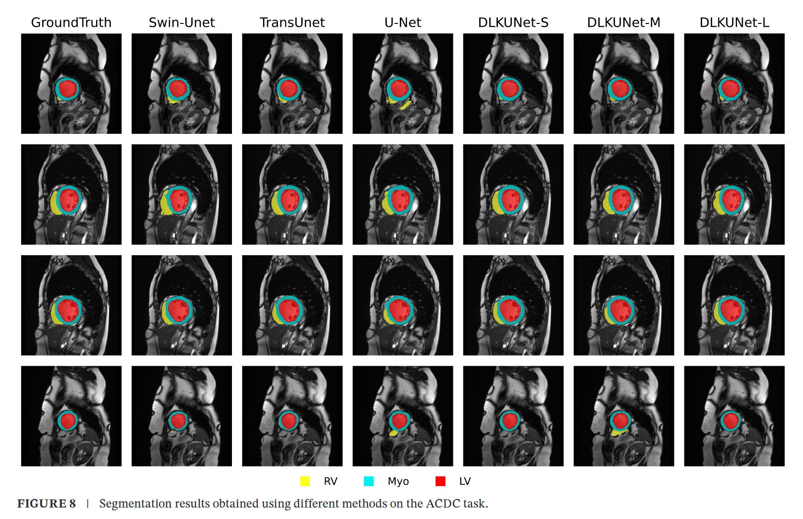

# DLKUNet: Lightweight and Efficient Network with Depthwise Large Kernel for Multi-Organ Segmentation

[](https://onlinelibrary.wiley.com/doi/abs/10.1002/ima.70035)
[](LICENSE)

Accurate multi-organ segmentation is crucial in computer-aided diagnosis, surgical navigation, and radiotherapy. This repository provides the official implementation of **DLKUNet**, a lightweight and efficient deep learning framework for medical image segmentation.

**Attention**: this repository is still building and maybe miss some files, we will upload more essential file in future.

---

## 🔥 Highlights



* **Lightweight & Efficient**: Uses depthwise large kernel convolutions for effective multi-scale feature extraction.
* **Flexible Models**: Provides **DLKUNet-S**, **DLKUNet-M**, and **DLKUNet-L** for different trade-offs between accuracy and speed.
* **Novel Training Strategy**: Designed to work seamlessly with the proposed architecture to boost performance.
* **Extensive Validation**: Evaluated on **Synapse multi-organ segmentation** and **ACDC cardiac segmentation** datasets.

---

## 📊 Main Results

* On **Synapse dataset**:

  * **DLKUNet-L** achieves **13.89 mm HD95**, with only **65% parameters** of Swin-Unet.



* On **ACDC dataset**:

  * **DLKUNet-S** achieves **91.71% Dice** using only **4.5% parameters** of Swin-Unet.
  * **DLKUNet-M** achieves **91.74% Dice** using only **16.52% parameters** of Swin-Unet.



These results demonstrate DLKUNet’s superior balance of **accuracy, efficiency, and practicality**.

**BTW**,I also opensource about how to generate the picture like this.
here is my ([code](https://github.com/University-Pro/Visualization_Medical_Images))
---

## 📂 Repository Structure

```
DLKUNet/
├── network/           # Network architectures, you can put you own network in this folder
├── datasets/          # put ACDC and Synapse data into this folder
  |── Synapse/
    |── data/
    |── train.list
    |── test.list
  |── ACDC/
    |── data/
    |── train.list
    |── test.list         
├── Dataloader_ACDC          # Dataloader of ACDC
├── Dataloader_Synapse  # Dataloader of Synapse
├── LogProcess.py   # Logging process file able to choose the best result from logging file
├── requirements.txt  # pypi file
├── Test_ACDC.py           # Test ACDC dataset
├── Test_Synapse.py        # Test Synapse dataset
├── Train_ACDC.py      # Train ACDC dataset
├── Train_Synpase.py    # Train Synapse dataset
└── README.md         # Project description
```

---

## 🖼️ Prepare Datasets

### 1. ACDC datasets
You can download the dataset from the Automated Cardiac Diagnosis Challenge(ACDC) offical website or other paper's repositories.

[ACDC Dataset Download Link](https://www.creatis.insa-lyon.fr/Challenge/acdc/databases.html)

after download, put the data into ./datasets/ACDC/data folder.

### 2. Synapse dataset

You can download the dataset from the offical website or other paper's repositories.

[Synapse Dataset Download Link](https://www.synapse.org/#!Synapse:syn3193805/wiki/217789)

after download, put the data into ./datasets/Synapse/data folder.

## 🚀 Getting Started

### 1. Clone Repository

```bash
git clone https://github.com/University-Pro/DLKUNet.git
cd DLKUNet
```

### 2. Create Environment

```bash
conda create -n torch-env python=3.12
conda activate torch-env
pip install -r requirements.txt
```

### 3. Train

```bash
python Train_Synapse.py
```

I developed this code using Data Parallel (DP) in PyTorch, which means you can use multiple GPUs to reduce training time.
if you need more option, please check the args in Training file, or using:

```bash
python Train_Synapse.py -h
```

### 4. Test

```bash
python Test_Synapse.py
```

---

## 📖 Citation

If you find this work useful, please cite our paper:

```bibtex
@article{wang2025dlkunet,
  title={DLKUNet: Lightweight and Efficient Network with Depthwise Large Kernel for Multi-Organ Segmentation},
  author={Your Name and Others},
  journal={IMA Journal of Applied Mathematics},
  year={2025},
  publisher={Wiley},
  doi={10.1002/ima.70035}
}
```

---

## 📌 Links

* 📄 [Paper (Wiley)](https://onlinelibrary.wiley.com/doi/abs/10.1002/ima.70035)
* 💻 [GitHub Repository](https://github.com/University-Pro/DLKUNet)

---

## 📜 License

This project is released under the [GPL3 License](LICENSE).
